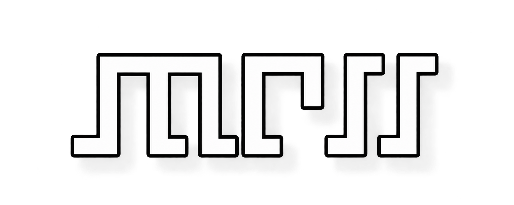
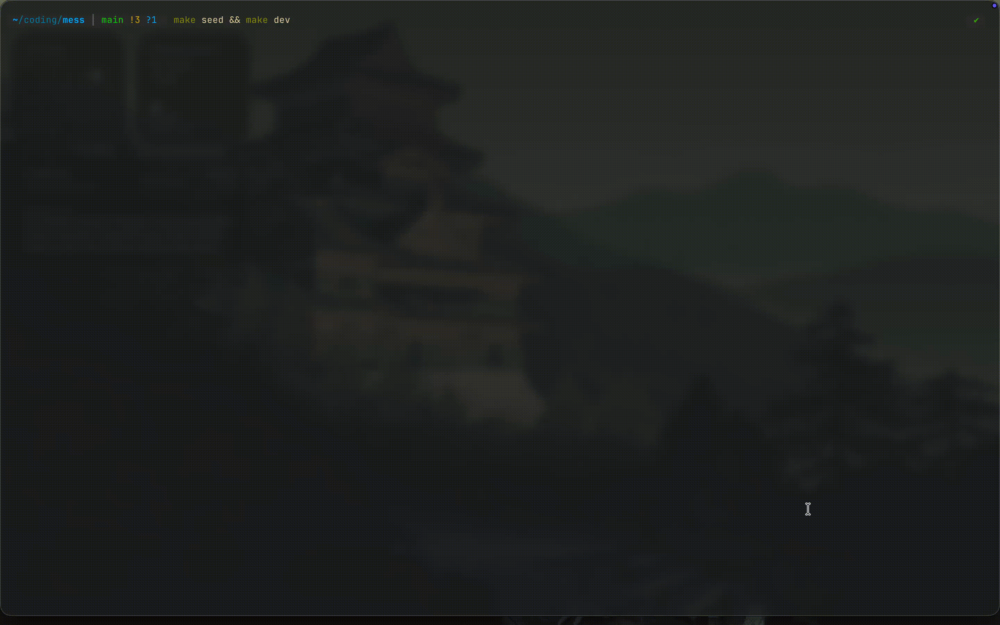

<div align="center">



_cool little tui project to keep track of my budgets, focused on ARS/USD values (inflation sucks..)_

[build](#build) · [use](#use) · [keep-your-data-portable](#keep-your-data-portable)

</div>

<!-- Add a short, anonymized terminal recording at docs/demo.gif. -->
<p align="center">
  
</p>

`mess` keeps recurring concepts, monthly amounts, notes, and exchange rates in
a local SQLite database. Build it from source, then run the binary.

## build

you need [Go 1.27](https://go.dev/dl/) and `make`. Clone the repository, then
build a native binary:

```sh
git clone <repository-url> mess
cd mess
make build
./bin/mess
```

the terminal UI needs at least 135 columns and 30 rows.

to build binaries for the supported release targets:

```sh
make build-all
```

this writes binaries to `bin/` for macOS (Apple Silicon), Linux (x86-64), and
Windows (x86-64). Copy the appropriate binary wherever you keep local tools.

## use

run `mess` with no arguments to create or open its default database:

```sh
./bin/mess
```

the default database is `mess/mess.db` below your OS configuration directory,
such as `~/Library/Application Support` on macOS. Pass `--db` to choose a
database path:

```sh
./bin/mess --db path/to/mess.db
```

export and import are plain JSON backups. Import asks for confirmation and
writes a timestamped copy of the existing database first.

```sh
./bin/mess export --db path/to/mess.db > mess-backup.json
./bin/mess import --db path/to/mess.db mess-backup.json
```

## keep your data portable

your data is the SQLite database at the path you choose, or the default path.
Copy it directly or export JSON for a backup. Git ignores databases, SQLite
sidecar files, backups, and the local demo directory.

to explore the application with disposable data:

```sh
make seed
make dev
```

`make seed` replaces `.data/mess.db`; it never touches the default database.

## development

```sh
make check  # formatting, vet, tests, and a native build
make fmt    # format Go sources
```

see [`internal/fixture/README.md`](internal/fixture/README.md) for the demo
fixture details.
